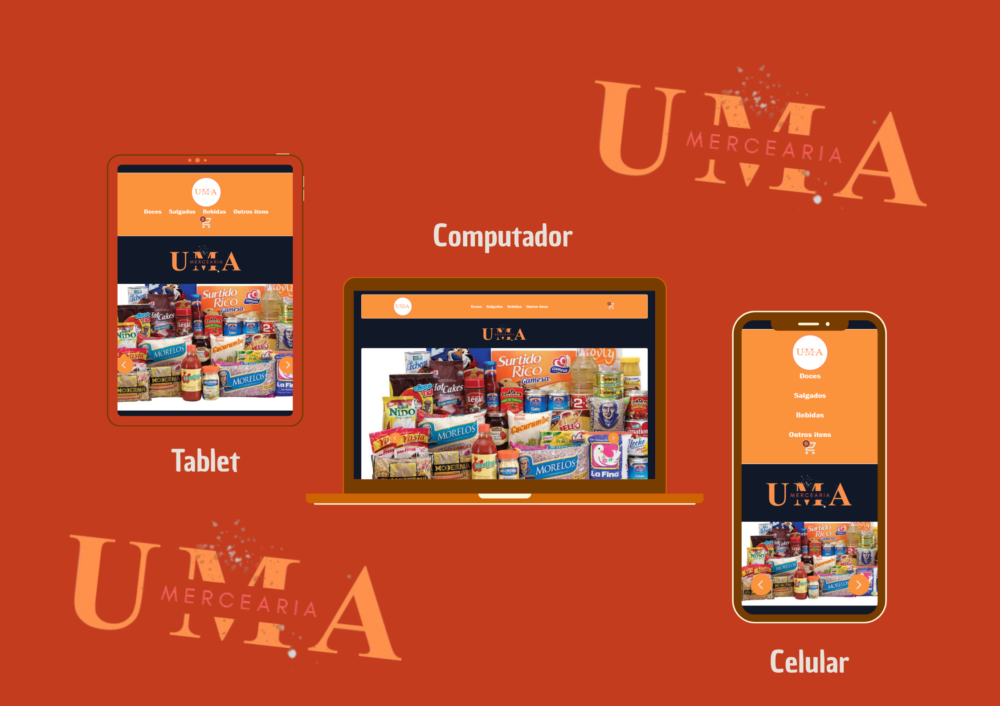

# 🛒 Pojeto Uma Mercearia  🛍️
## Projeto responsivo 📲 💻

<h2>Sobre o projeto</h2>

<h3>Descrição: </h3>

    O projeto é uma mini mercardinho (mercearia), onde o usuário poderá escolher o produto desejado, inserir no carrinho e finaliza - lo realizando o pagamento por meio do Pix.

## Abaixo o link para visitar o site 👇🏻

<h1> <a href="https://rmarlon.github.io/Uma-mercearia/src/index.html#slider"> Visite o site 🖥️ 📲</a></h1>

## Ferramentas utilizadas 🛠️

- [HTML5](https://developer.mozilla.org/pt-BR/docs/Web/HTML/Element)
- [CSS3](https://developer.mozilla.org/pt-BR/docs/Web/CSS)
- [Tailwindcss](https://v3.tailwindcss.com/docs/installation)
- [JavaScript](https://developer.mozilla.org/pt-BR/docs/Web/JavaScript)
- [TypeScript](https://www.typescriptlang.org/docs/handbook/typescript-in-5-minutes.html)